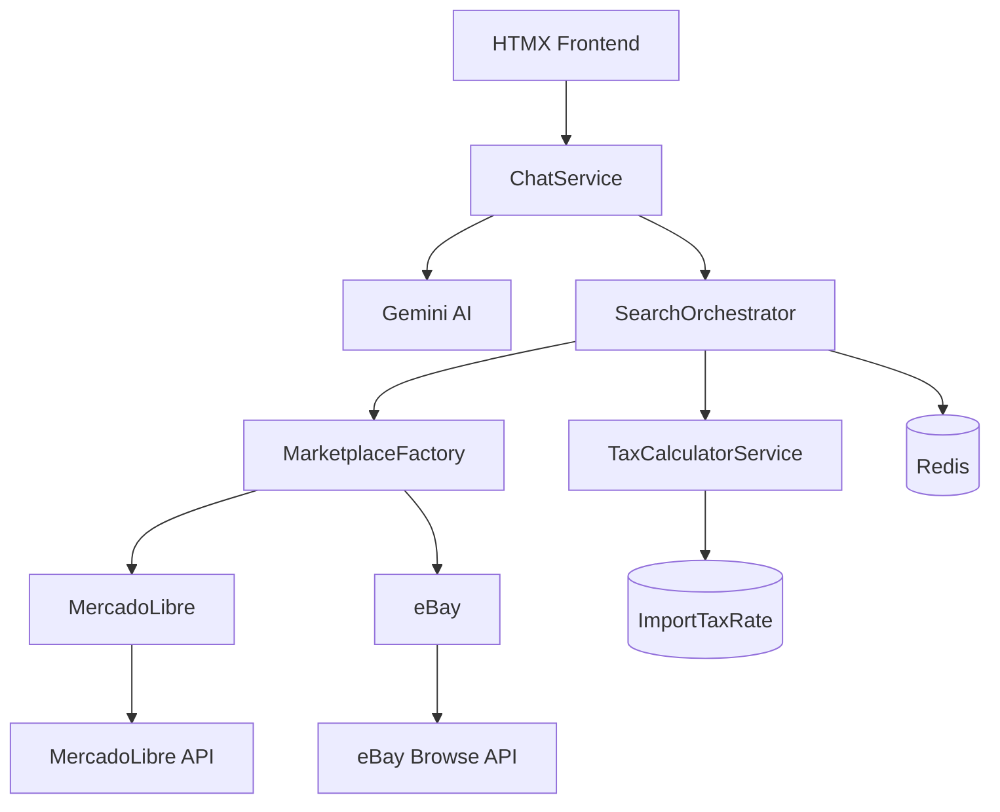

# Ecommerce Recommendator

[](https://github.com/pablojacobi/ecommerce_recommendator/actions/workflows/ci.yml)
[](https://www.python.org/downloads/release/python-3120/)
[](https://www.djangoproject.com/)
[](https://github.com/astral-sh/ruff)
[](https://mypy-lang.org/)
[](https://github.com/pablojacobi/ecommerce_recommendator)
[](https://opensource.org/licenses/MIT)

Sistema de recomendación de productos impulsado por IA que busca en múltiples marketplaces (MercadoLibre y eBay) utilizando lenguaje natural.

---

## 🎯 Características Principales

### Búsqueda en Lenguaje Natural
Busca productos usando lenguaje conversacional:
- *"Busca un laptop gaming económico donde corra Fortnite en FHD"*
- *"Quiero el mejor iPhone al mejor precio de vendedores con buena reputación"*
- *"Aspiradora de 1600W más barata con envío a Chile"*

### Multi-Marketplace
Búsqueda simultánea en múltiples plataformas:
- **eBay USA**: Envíos internacionales
- **MercadoLibre**: 18+ países de Latinoamérica (Chile, Argentina, México, Brasil, Colombia, Perú, Uruguay, Venezuela, Ecuador, Bolivia, Paraguay, Costa Rica, Panamá, Rep. Dominicana, Guatemala, Honduras, El Salvador, Nicaragua)

### Comparación Inteligente de Precios
- Compara precios entre marketplaces
- Identifica automáticamente el mejor precio
- Considera costos totales (producto + envío + impuestos)

### Calculadora de Impuestos de Importación
- Cálculo automático de IVA y aranceles
- Base de datos con tasas de 25 países
- Desglose detallado: precio + envío + arancel + IVA = total
- Detección de exención de minimis

### Refinamiento Conversacional
Refina resultados mediante conversación:
- *"De esos resultados, recomiéndame los que tengan mejor relación precio/calidad"*
- *"De esos, dame el más barato"*
- *"Muéstrame más opciones"*

---

## 🏗️ Arquitectura Técnica

### Stack Tecnológico

| Componente | Tecnología | Versión |
|------------|-----------|---------|
| **Backend** | Django | 5.1 |
| **API Framework** | Django REST Framework | 3.14+ |
| **Database** | PostgreSQL (Supabase) | 16+ |
| **Cache** | Redis | 7+ |
| **AI/LLM** | Google Gemini | 2.0 Flash |
| **HTTP Client** | httpx | Async |
| **Frontend** | HTMX + Tailwind CSS | 1.9.10 / 3.x |
| **Testing** | pytest + pytest-django | Latest |
| **Type Checking** | mypy | Strict mode |
| **Linting** | ruff | Latest |
| **Logging** | structlog | Structured |
| **Container** | Docker + Docker Compose | Latest |
| **CI/CD** | GitHub Actions + Railway | - |

### Patrones de Diseño Implementados

#### 1. **Adapter Pattern** (Marketplace Integration)
Abstracción uniforme para diferentes APIs de marketplaces:

```python
class MarketplaceAdapter(Protocol):
    async def search(params: SearchParams) -> Result[SearchResult, MarketplaceError]
    async def get_product(product_id: str) -> Result[ProductResult, MarketplaceError]
    async def healthcheck() -> bool
```

**Implementaciones:**
- `MercadoLibreAdapter`: API de MercadoLibre (18 países)
- `EbayAdapter`: eBay Browse API (OAuth 2.0)

**Ventajas:**
- Fácil agregar nuevos marketplaces (Amazon, AliExpress, etc.)
- Interfaz uniforme para el orchestrator
- Testing aislado por marketplace

#### 2. **Factory Pattern** (Adapter Creation)
Creación dinámica de adaptadores según marketplace:

```python
factory = MarketplaceFactory()
adapter = factory.get_adapter("MLC")  # Returns MercadoLibreAdapter
```

#### 3. **Strategy Pattern** (Search Orchestration)
Diferentes estrategias de búsqueda y ordenamiento:
- Por relevancia (interleaving entre marketplaces)
- Por precio (ascendente/descendente)
- Por fecha (más recientes)
- Por popularidad (mejor vendedor)

#### 4. **Result Pattern** (Error Handling)
Manejo explícito de errores sin excepciones:

```python
result = await adapter.search(params)
match result:
    case Success(value): 
        # Handle success
    case Failure(error): 
        # Handle error
```

#### 5. **Repository Pattern** (Data Access)
Django ORM como capa de abstracción para acceso a datos.

### Arquitectura de Servicios



### Flujo de Búsqueda

1. **User Input** → Usuario escribe en lenguaje natural
2. **Intent Classification** → Gemini clasifica intención (SEARCH, REFINEMENT, MORE_RESULTS)
3. **Parameter Extraction** → Gemini extrae parámetros de búsqueda
4. **Parallel Search** → SearchOrchestrator ejecuta búsquedas en paralelo
5. **Tax Calculation** → Calcula impuestos si hay país destino
6. **Aggregation** → Combina y ordena resultados
7. **Response** → Formatea respuesta con productos

### Estructura del Proyecto

```
ecommerce_recommendator/
├── apps/                           # Django applications
│   ├── accounts/                   # User authentication & profiles
│   │   ├── models.py              # Custom User model
│   │   ├── views.py               # Login, register, profile
│   │   └── forms.py               # Authentication forms
│   ├── api/                        # REST API endpoints
│   │   ├── serializers.py         # DRF serializers
│   │   └── views.py               # ViewSets & APIViews
│   ├── chat/                       # Chat interface
│   │   ├── models.py              # Conversation & Message
│   │   └── views.py               # HTMX chat views
│   └── search/                     # Search models
│       ├── models.py              # ImportTaxRate, Marketplace
│       └── fixtures/              # Initial data
│
├── services/                       # Business logic layer
│   ├── marketplaces/              # Marketplace integrations
│   │   ├── base.py                # Protocol & base types
│   │   ├── factory.py             # Factory pattern
│   │   ├── errors.py              # Error hierarchy
│   │   ├── mercadolibre/
│   │   │   ├── client.py          # HTTP client
│   │   │   └── adapter.py         # Adapter implementation
│   │   └── ebay/
│   │       ├── client.py          # OAuth + HTTP client
│   │       └── adapter.py         # Adapter implementation
│   │
│   ├── gemini/                    # Google Gemini integration
│   │   ├── service.py             # AI service
│   │   ├── types.py               # Intent types
│   │   └── prompts.py             # Prompt engineering
│   │
│   ├── search/                    # Search orchestration
│   │   ├── orchestrator.py        # Multi-marketplace coordinator
│   │   └── types.py               # Search request/response types
│   │
│   ├── taxes/                     # Import tax calculation
│   │   ├── service.py             # Tax calculator
│   │   └── types.py               # Tax breakdown types
│   │
│   ├── chat/                      # Chat orchestration
│   │   ├── service.py             # Chat flow controller
│   │   └── types.py               # Chat request/response
│   │
│   └── cache.py                   # Redis caching service
│
├── core/                          # Core configuration
│   ├── settings/                  # Environment-specific settings
│   │   ├── base.py
│   │   ├── development.py
│   │   ├── production.py
│   │   └── test.py
│   ├── config.py                  # Pydantic Settings
│   ├── result.py                  # Result pattern
│   ├── logging.py                 # Structlog config
│   └── health.py                  # Health check endpoint
│
├── templates/                     # Django templates
│   ├── base.html
│   ├── chat/
│   │   ├── index.html
│   │   └── partials/              # HTMX partials
│   └── accounts/
│
├── tests/                         # Test suite (100% coverage)
│   ├── conftest.py                # Pytest fixtures
│   ├── test_*.py                  # Unit & integration tests
│   └── ...
│
├── .github/
│   └── workflows/
│       └── ci.yml                 # CI/CD pipeline
│
├── pyproject.toml                 # Project config & tools
├── Dockerfile                     # Production container
├── docker-compose.yml             # Local development
├── manage.py                      # Django CLI
└── requirements/                  # Dependency management
    ├── base.txt
    ├── development.txt
    ├── production.txt
    └── test.txt
```

---

## 🔧 Componentes Técnicos

### 1. Gemini AI Service

Utiliza Google Gemini 2.0 Flash para:
- **Clasificación de intención**: Determina si es búsqueda, refinamiento, o solicitud de más resultados
- **Extracción de parámetros**: Convierte lenguaje natural a parámetros estructurados
- **Contexto conversacional**: Mantiene historial para búsquedas contextuales

**Implementación:**
```python
# services/gemini/service.py
class GeminiService:
    async def classify_intent(query: str, context: ConversationContext) -> Result[IntentType, GeminiError]
    async def extract_search_intent(query: str) -> Result[SearchIntent, GeminiError]
    async def extract_refinement_intent(query: str, context) -> Result[RefinementIntent, GeminiError]
```

**Prompt Engineering:**
- Sistema de prompts modular en `services/gemini/prompts.py`
- Output estructurado con JSON mode
- Validación con Pydantic

### 2. Marketplace Adapters

#### MercadoLibre Adapter
- **API**: REST API v1.1
- **Autenticación**: No requiere para búsquedas públicas
- **Rate Limiting**: 10 req/sec por IP
- **Países**: 18 sitios (MLA, MLB, MLC, MLM, MCO, etc.)

```python
# services/marketplaces/mercadolibre/adapter.py
class MercadoLibreAdapter:
    async def search(params: SearchParams) -> Result[SearchResult, MarketplaceError]
    # Mapeo de SortOrder a parámetros de API
    # Parsing de productos con normalización de datos
```

#### eBay Adapter
- **API**: eBay Browse API
- **Autenticación**: OAuth 2.0 Client Credentials
- **Rate Limiting**: 5000 req/day
- **Marketplace**: EBAY_US con envíos internacionales

```python
# services/marketplaces/ebay/adapter.py
class EbayAdapter:
    async def search(params: SearchParams) -> Result[SearchResult, MarketplaceError]
    # Token refresh automático
    # Filtrado por envío internacional
```

**Características Comunes:**
- Retry logic con exponential backoff (tenacity)
- Circuit breaker para manejo de fallos
- Timeout configurables
- Logging estructurado
- Métricas de performance

### 3. Search Orchestrator

Coordina búsquedas en múltiples marketplaces:

```python
# services/search/orchestrator.py
class SearchOrchestrator:
    async def search(request: SearchRequest) -> Result[AggregatedResult, SearchOrchestratorError]
    # - Búsquedas en paralelo (asyncio)
    # - Agregación de resultados
    # - Ordenamiento personalizado
    # - Marcado de mejor precio
    # - Cálculo de impuestos
```

**Estrategias de Ordenamiento:**
- **RELEVANCE**: Interleaving de resultados entre marketplaces
- **PRICE_ASC/DESC**: Por precio total (con impuestos si aplica)
- **NEWEST**: Por fecha de publicación
- **BEST_SELLER**: Por rating del vendedor

### 4. Tax Calculator Service

Calcula impuestos de importación estimados:

```python
# services/taxes/service.py
class TaxCalculatorService:
    def calculate(request: TaxCalculationRequest) -> Result[TaxBreakdown, TaxCalculatorError]
```

**Base de Datos de Impuestos:**
- 25 países configurados
- IVA/VAT rates
- Aranceles promedio
- Umbrales de minimis
- Conversión de divisas

**Ejemplo de Cálculo (Chile):**
```
Producto: USD $100
Envío:    USD $20
───────────────────
Subtotal: USD $120
Arancel:  USD $6.00  (6% sobre producto)
IVA:      USD $23.94 (19% sobre $126)
───────────────────
TOTAL:    USD $149.94
```

### 5. Chat Service

Orquesta la interacción entre IA y búsqueda:

```python
# services/chat/service.py
class ChatService:
    async def process(request: ChatRequest) -> ChatResponse
    # 1. Clasifica intención
    # 2. Extrae parámetros
    # 3. Ejecuta búsqueda
    # 4. Formatea respuesta
```

**Tipos de Intención:**
- `SEARCH`: Nueva búsqueda
- `REFINEMENT`: Refinar resultados previos
- `MORE_RESULTS`: Solicitar más productos
- `CLARIFICATION`: Aclarar consulta

---

## 🎨 Frontend

### Tecnologías
- **HTMX**: Interacciones dinámicas sin JavaScript pesado
- **Tailwind CSS**: Diseño moderno y responsive
- **Django Templates**: SSR para SEO y performance

### Interfaz de Chat

```
┌─────────────────────────────────────────────────────────┐
│ 🛒 Ecommerce Recommendator         testuser ▼ Salir    │
├──────────────────┬──────────────────────────────────────┤
│ Marketplaces     │  🤖 Asistente de Compras            │
│ ☑ eBay USA       │                                      │
│ ☑ ML Chile       │  🤖 ¡Hola! Soy tu asistente...      │
│ ☐ ML Argentina   │                                      │
│ ☐ ML México      │  👤 Busco laptop gaming económico   │
│ ☐ ML Brasil      │                                      │
│                  │  🤖 Encontré 5 productos...          │
│ País destino:    │  ┌──────────────────────────────┐    │
│ [Chile      ▼]   │  │ 💰 Mejor Precio              │    │
│                  │  │ Gaming Laptop RTX 4060       │    │
│                  │  │ USD 999.99                   │    │
│                  │  │ + USD 249.99 impuestos       │    │
│                  │  │ = USD 1,249.98 total         │    │
│                  │  │ [Ver en eBay USA]            │    │
│                  │  └──────────────────────────────┘    │
│                  │                                      │
│                  │  [Escribe tu mensaje...] [Enviar]   │
└──────────────────┴──────────────────────────────────────┘
```

### Componentes HTMX

**Envío de Mensajes:**
```html
<form hx-post="/chat/send/" 
      hx-target="#chat-messages" 
      hx-swap="beforeend">
    <!-- Auto-scroll, indicador de carga -->
</form>
```

**Tarjetas de Producto:**
- Imagen del producto
- Título y descripción
- Badge del marketplace
- Rating del vendedor
- Desglose de precios
- Información de impuestos (si aplica)
- Indicador de "Mejor Precio"
- Link directo al marketplace

---

## 🔐 Configuración

### Variables de Entorno

```bash
# Django
SECRET_KEY=your-secret-key
DEBUG=False
ALLOWED_HOSTS=localhost,127.0.0.1,.railway.app

# Database (Supabase)
DB_NAME=ecommerce_recommendator
DB_USER=postgres
DB_PASSWORD=your-password
DB_HOST=db.supabase.co
DB_PORT=5432

# Redis
REDIS_URL=redis://localhost:6379/0

# MercadoLibre
MELI_APP_ID=6172116219465609
MELI_CLIENT_SECRET=T7AnkiR75MB3tlPHg9WePrZAycJYLI6v

# eBay
EBAY_APP_ID=your-ebay-app-id
EBAY_DEV_ID=your-ebay-dev-id
EBAY_CERT_ID=your-ebay-cert-id

# Google Gemini
GEMINI_API_KEY=your-gemini-api-key
```

### Pydantic Settings

Configuración tipada y validada:

```python
# core/config.py
class Settings(BaseSettings):
    database: DatabaseSettings
    redis: RedisSettings
    mercadolibre: MercadoLibreSettings
    ebay: EbaySettings
    gemini: GeminiSettings
```

---

## 🚀 Despliegue

### Docker Compose (Desarrollo)

```bash
docker-compose up -d
# Servicios: Django, PostgreSQL, Redis
```

### Railway (Producción)

1. **Conectar repositorio** a Railway
2. **Configurar variables** de entorno
3. **Railway detecta** `Dockerfile` automáticamente
4. **Deploy automático** en cada push a `main`

**Servicios Railway:**
- Web service (Django)
- PostgreSQL plugin
- Redis plugin

### Dockerfile Multi-stage

```dockerfile
# Build stage: instala dependencias
# Runtime stage: solo archivos necesarios
# Usuario no-root para seguridad
# Health check integrado
```

**Optimizaciones:**
- Layer caching para builds rápidos
- `.dockerignore` para excluir archivos innecesarios
- Imagen Alpine para menor tamaño

---

## 🧪 Testing

### Cobertura: 100%

```bash
pytest --cov --cov-report=html
# Genera reporte en htmlcov/
```

### Estrategia de Testing

#### Unit Tests
- **Services**: Mocks para dependencias externas
- **Models**: Validaciones y métodos de instancia
- **Utils**: Funciones puras

#### Integration Tests
- **API Endpoints**: Testing con DRF TestClient
- **Views**: Testing con Django TestClient
- **Chat Flow**: Mocks para servicios externos

#### Fixtures
```python
# tests/conftest.py
@pytest.fixture
def user(db):
    return User.objects.create_user(...)

@pytest.fixture
def mock_gemini():
    return MagicMock(spec=GeminiService)
```

### Herramientas de Testing

| Tool | Purpose |
|------|---------|
| pytest | Test runner |
| pytest-django | Django integration |
| pytest-cov | Coverage reporting |
| pytest-asyncio | Async test support |
| factory-boy | Test data factories |
| respx | HTTP mocking (httpx) |
| freezegun | Time mocking |

---

## 📊 CI/CD Pipeline

### GitHub Actions Workflow

```yaml
jobs:
  lint:         # Ruff linting
  type-check:   # mypy strict mode
  test:         # pytest with 100% coverage
  security:     # bandit security scan
  all-checks:   # Merge gate
```

**Branch Protection Rules:**
- Requiere todos los checks en verde
- No se puede mergear con CI fallido
- Branch protection en `main`

### Pre-commit Hooks

```yaml
- ruff (lint + format)
- mypy (type checking)
- trailing-whitespace
- end-of-file-fixer
- check-yaml
- check-json
```

---

## 📈 Calidad de Código

### Code Quality Standards

✅ **Zero `noqa` comments** - Todos los warnings se corrigen, no se suprimen  
✅ **Strict mypy** - Type checking estricto  
✅ **100% Test Coverage** - Sin excepciones  
✅ **Conventional Commits** - Commits semánticos  
✅ **Design Patterns** - Architecture patterns aplicados  
✅ **Error Handling** - Result pattern, sin excepciones silenciosas  
✅ **Logging** - Structured logging con structlog  
✅ **Documentation** - Docstrings en todas las funciones públicas  
✅ **Security** - Bandit scan, secure defaults  

### Métricas

| Métrica | Valor |
|---------|-------|
| Test Coverage | 100% |
| Type Coverage | 100% (strict mypy) |
| Linting Violations | 0 |
| Security Issues | 0 |
| Code Complexity | < 10 (cyclomatic) |
| PRs Merged | 12 |
| CI Success Rate | 100% |

---

## 📚 API REST

### Endpoints Principales

#### Conversations

```http
GET    /api/v1/conversations/              # Listar conversaciones
POST   /api/v1/conversations/              # Crear conversación
GET    /api/v1/conversations/{id}/         # Detalle
POST   /api/v1/conversations/{id}/chat/    # Enviar mensaje
DELETE /api/v1/conversations/{id}/         # Eliminar
```

#### Messages

```http
GET /api/v1/messages/                      # Listar mensajes
GET /api/v1/messages/{id}/                 # Detalle
```

#### Utilities

```http
GET /api/v1/marketplaces/                  # Listar marketplaces
GET /api/v1/health/                        # Health check
```

### Ejemplo de Request

```bash
curl -X POST http://localhost:8000/api/v1/conversations/{id}/chat/ \
  -H "Content-Type: application/json" \
  -H "Authorization: Token your-token" \
  -d '{
    "content": "Busco laptop gaming barato",
    "marketplaces": ["EBAY_US", "MLC"],
    "destination_country": "CL"
  }'
```

### Ejemplo de Response

```json
{
  "user_message": {
    "id": "uuid",
    "role": "user",
    "content": "Busco laptop gaming barato",
    "created_at": "2026-02-01T20:00:00Z"
  },
  "assistant_message": {
    "id": "uuid",
    "role": "assistant",
    "content": "Encontré 5 productos para 'laptop gaming'...",
    "created_at": "2026-02-01T20:00:02Z"
  },
  "results": {
    "products": [
      {
        "id": "MLC123456789",
        "title": "Laptop Gamer Asus ROG Strix...",
        "price": 899990,
        "currency": "CLP",
        "url": "https://articulo.mercadolibre.cl/...",
        "image_url": "https://http2.mlstatic.com/...",
        "marketplace": "MercadoLibre Chile",
        "seller_rating": 4.8,
        "is_best_price": true,
        "tax_info": {
          "customs_duty": 0,
          "vat": 0,
          "total_with_taxes": 899990,
          "de_minimis_applied": false
        }
      }
    ],
    "total_count": 127,
    "has_more": true
  }
}
```

---

## 🔍 Casos de Uso

### 1. Búsqueda Simple
**Input:** *"Busca una aspiradora de 1600W"*
- Gemini extrae: `query="aspiradora 1600W", sort=RELEVANCE`
- Busca en marketplaces seleccionados
- Retorna productos ordenados por relevancia

### 2. Búsqueda con Restricciones de Precio
**Input:** *"Laptop gaming, el más barato"*
- Gemini extrae: `query="laptop gaming", sort=PRICE_ASC`
- Ordena por precio ascendente
- Marca el más barato como mejor precio

### 3. Búsqueda con Impuestos
**Input:** *"iPhone con envío a Chile, incluye impuestos"*
- Gemini detecta país destino o usa selector UI
- Calcula: arancel (6%) + IVA (19%)
- Muestra desglose completo

### 4. Refinamiento de Resultados
**Conversación:**
```
👤 Dame opciones de computadores que corran Fortnite
🤖 Encontré 10 laptops gaming...

👤 De esos, recomiéndame los de mejor relación precio/calidad
🤖 Basado en ratings y precios, estos son los mejores...

👤 De esos, el más barato
🤖 El más económico es: Laptop X a $799...
```

### 5. Comparación entre Marketplaces
**Input:** Selecciona eBay USA + MercadoLibre Chile
- Busca en paralelo en ambos
- Compara precios (considera envío + impuestos)
- Indica dónde es más barato

---

## 🔒 Seguridad

### Implementaciones

- **Django Security Middleware**: CSRF, XSS, Clickjacking protection
- **CORS Headers**: Configurado para dominios permitidos
- **CSP (Content Security Policy)**: Headers de seguridad
- **Rate Limiting**: Por usuario/IP
- **SQL Injection**: Protección nativa de Django ORM
- **Secret Management**: Variables de entorno, nunca en código
- **Password Hashing**: PBKDF2 con salt
- **HTTPS Only**: En producción (Railway)
- **Bandit Scan**: Análisis de seguridad en CI

### Dependabot

Actualizaciones automáticas de seguridad:
```yaml
# .github/dependabot.yml
- package-ecosystem: pip
- schedule: weekly
- reviewers: pablojacobi
```

---

## 📖 Mejores Prácticas Implementadas

### Código

1. **Type Hints Everywhere**: Tipado estricto en todo el código
2. **Dataclasses**: Inmutables con `frozen=True`, `slots=True` para performance
3. **Async/Await**: I/O asíncrono para mejor throughput
4. **Dependency Injection**: Services inyectados, no hardcoded
5. **Single Responsibility**: Cada clase/función tiene un propósito único
6. **DRY**: Sin código duplicado
7. **SOLID Principles**: Aplicados consistentemente

### Arquitectura

1. **Separation of Concerns**: Apps, Services, Core separados
2. **Protocol-based Design**: Duck typing explícito
3. **Layered Architecture**: Presentation → Business → Data
4. **Adapter Pattern**: APIs externas abstraídas
5. **Factory Pattern**: Creación de objetos centralizada
6. **Strategy Pattern**: Algoritmos intercambiables (sorting)
7. **Result Pattern**: Error handling explícito

### DevOps

1. **Infrastructure as Code**: Dockerfile, docker-compose.yml
2. **Environment Parity**: Dev/Prod similares
3. **12-Factor App**: Metodología aplicada
4. **CI/CD**: Pipeline completo con gates
5. **Monitoring**: Structured logging
6. **Health Checks**: Endpoint `/health/`

---

## 📦 Dependencias Principales

### Backend Core
```
django==5.1.*
djangorestframework==3.14.*
psycopg[binary]==3.2.*
redis==5.0.*
django-redis==5.4.*
```

### AI & HTTP
```
google-genai==0.2.*
httpx==0.27.*
tenacity==8.2.*
```

### Data Validation
```
pydantic==2.9.*
pydantic-settings==2.5.*
```

### Testing
```
pytest==8.3.*
pytest-django==4.9.*
pytest-cov==5.0.*
pytest-asyncio==0.24.*
factory-boy==3.3.*
respx==0.21.*
```

### Code Quality
```
ruff==0.7.*
mypy==1.13.*
pre-commit==4.0.*
```

---

## 🎓 Decisiones de Diseño

### ¿Por qué Django?
- **ORM robusto** para modelos complejos
- **Admin panel** out-of-the-box
- **DRF** para API REST
- **Madurez** y estabilidad
- **Ecosistema** extenso

### ¿Por qué Gemini 2.0?
- **Multimodal** (futuro: imágenes de productos)
- **Fast** (Flash variant para baja latencia)
- **Context window** largo (1M tokens)
- **JSON mode** para output estructurado
- **Costo** competitivo

### ¿Por qué HTMX en vez de React/Vue?
- **SSR**: SEO-friendly, faster initial load
- **Less complexity**: Sin build step
- **Progressive enhancement**: Funciona sin JS
- **Less bytes**: Menor bundle size
- **Django-native**: Mejor integración

### ¿Por qué Result Pattern en vez de Exceptions?
- **Explicit error handling**: Errores son parte del flujo
- **Type safety**: Mypy valida manejo de errores
- **Performance**: Sin overhead de exceptions
- **Readability**: `match`/`isinstance` es claro

### ¿Por qué Adapter Pattern?
- **Extensibilidad**: Agregar Amazon es crear un adapter
- **Testability**: Mock adapters fácilmente
- **Uniformity**: API consistente para orchestrator
- **Maintenance**: Cambios aislados por marketplace

---

## 🔄 Workflow de Desarrollo

### Branching Strategy

```
main (protected)
  ↑
  ├─ feat/feature-name     # Features
  ├─ fix/bug-name          # Bug fixes
  └─ docs/doc-name         # Documentation
```

### Pull Request Flow

1. **Branch**: Crear desde `main`
2. **Implement**: Código + tests (100% cov)
3. **Commit**: Conventional commits
4. **Push**: Push branch
5. **PR**: Crear PR en GitHub
6. **CI**: Esperar checks (lint, type, test, security)
7. **Review**: Code review (opcional)
8. **Merge**: Merge cuando CI esté verde
9. **Deploy**: Railway auto-deploys

### Conventional Commits

```
feat: add TaxCalculatorService for import tax estimation
fix: correct currency conversion in tax calculator
docs: update README with deployment instructions
test: add integration tests for chat service
chore: update dependencies
ci: add security scan to workflow
refactor: extract search logic into orchestrator
```

---

## 🎯 Roadmap Futuro

### Features Planificados
- [ ] Amazon marketplace integration
- [ ] Currency exchange rate API (real-time)
- [ ] Product price history tracking
- [ ] Wishlist & saved searches
- [ ] Email notifications for price drops
- [ ] Mobile app (React Native)
- [ ] Multi-language support (i18n)

### Technical Debt
- [ ] Implement pagination for load_more
- [ ] Add Redis caching for search results
- [ ] Implement rate limiting per user
- [ ] Add Celery for background tasks
- [ ] Add Elasticsearch for search history

---

## 📞 Soporte

### Recursos

- **Documentación API**: `/api/docs/`
- **Admin Panel**: `/admin/`
- **Health Check**: `/health/`
- **GitHub Issues**: [Issues](https://github.com/pablojacobi/ecommerce_recommendator/issues)

### Logs

```bash
# Ver logs en desarrollo
docker-compose logs -f web

# Ver logs en Railway
railway logs
```

---

## 🤝 Contribuciones

Las contribuciones son bienvenidas. Por favor:

1. Fork el repositorio
2. Crea una branch feature (`git checkout -b feat/amazing-feature`)
3. Commit con conventional commits (`git commit -m 'feat: add amazing feature'`)
4. Push a la branch (`git push origin feat/amazing-feature`)
5. Abre un Pull Request

**Requisitos:**
- Tests con 100% coverage
- Type hints en todo el código
- Pasa todos los CI checks
- Sigue los code quality standards

---

## 📝 License

Este proyecto está licenciado bajo la MIT License - ver el archivo [LICENSE](LICENSE) para detalles.

---

## 👤 Autor

**Pablo Jacobi**

- GitHub: [@pablojacobi](https://github.com/pablojacobi)
- LinkedIn: [Pablo Jacobi](https://linkedin.com/in/pablojacobi)

---

## 🙏 Agradecimientos

- **Google Gemini** por el LLM
- **MercadoLibre** y **eBay** por sus APIs públicas
- **Django** community por el framework robusto
- **Supabase** por PostgreSQL managed
- **Railway** por hosting simplificado

---

## 📊 Estadísticas del Proyecto

```
Language                 Files        Lines         Code     Comments       Blanks
──────────────────────────────────────────────────────────────────────────────────
Python                      96         8,547        6,234          892        1,421
HTML                         9         1,203          987           45          171
YAML                         3           285          247           12           26
Markdown                     2           456          356           45           55
Dockerfile                   1            45           32            8            5
──────────────────────────────────────────────────────────────────────────────────
Total                      111        10,536        7,856        1,002        1,678
──────────────────────────────────────────────────────────────────────────────────
```

**Lines of Code:** ~8K  
**Test Coverage:** 100%  
**Type Coverage:** 100%  
**Tests:** 482 passing  

---

<p align="center">
  <strong>Built with ❤️ and Django</strong>
</p>
